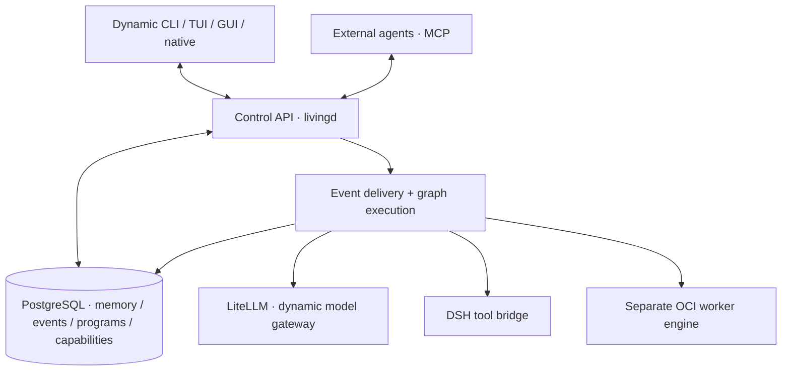

# Living Intelligence
## Executable Architecture and Bootstrap Contracts

**Architecture specification · 8 October 2026**  
**Status:** See [implementation.md](implementation.md) for the tested development subset. Full autonomous intelligence remains a research objective.

## 1. System boundary

Living Intelligence is an ongoing, database-defined computation. Its persistent identity lives in **PostgreSQL**, independently deployable from its executor. PostgreSQL owns **memory** (knowledge objects, claims, evidence, retrieval indexes), events, goals, scopes, graph programs, policies, executions, permissions, and interface definitions. **`livingd` is the stateless-in-principle control/execution service**: it operates on database state, runs versioned programs and bounded workers, and coordinates atomic transitions. It holds no authoritative parallel memory or independent cognitive/agent loop. Operational connection pools and caches are disposable.

A pinned **Nix build** produces the core image, distributed via a `Dockerfile`; **Compose** deploys `livingd` alongside optional local PostgreSQL, LiteLLM, DSH, and inference services. PostgreSQL can instead be remote. A **separate worker OCI endpoint** runs isolated conventional programs, with credentials segregated from the Compose host. The host filesystem remains conventional. A logical computational unit is a nested database scope; an OCI sandbox is allocated only when physical process isolation is required.

**LiteLLM is the sole model gateway.** `livingd` discovers the models available to the database-stored virtual key through LiteLLM `/v1/models`; model policy and inference use those IDs and `/v1/chat/completions`. PostgreSQL owns encrypted integration credentials, selected model IDs and gateway configuration. The single optional `dsh-living` plugin bridges tool nodes to DSH's guarded tool execution; it does not choose models or run an independent agent loop. All external systems remain unmodified.



## 2. One dynamic interface

**Control is the canonical API, not one particular UI.** Database-owned capability definitions specify action ID, input/output JSON Schema, side-effect class, permissions, execution-graph binding, discoverability, and optional view references. Database-owned view definitions specify a typed component tree, data subscriptions, context actions and required render primitives. All definitions are versioned and scope-filtered.

| Surface | Generic runtime behavior |
|---|---|
| CLI | Fetch catalog; generate command paths, flags, completions and textual/JSON results from action schemas |
| TUI | Render the same catalog as command palette, structured panes, graph/timeline and forms |
| GUI / native | Render typed view trees, omnibar, interactive graph and artifacts; expose device features as scoped capabilities |
| Agent via MCP | Project permitted Control actions to MCP tools, readable handles to resources, optional guidance to prompts and compatible rich views to MCP Apps |

The compiled clients only implement authentication, protocol transport, accessibility, generic renderers and optional sandboxed renderer extensions. They **do not own a separate command catalog, memory store, graph dispatcher or agent**. Unsupported view primitives degrade to schema-derived structured data; underlying authorized operations remain callable.

**Initial endpoints (versioned contract):** `GET /v1/control/catalog`, `GET /v1/control/views/{id}`, `POST /v1/control/actions/{id}`, `POST /v1/inputs`, `GET /v1/control/handles/{id}`, `GET /v1/control/stream`. Clients authenticate, declare rendering/device capabilities, fetch catalog + snapshots, then subscribe for updates. Stream reconnection uses a server-issued delivery token and snapshot repair, **not** `MAX(event_id)`.

## 3. Shared persistence and invariants

| Stored record | Authoritative content |
|---|---|
| `objects`, `revisions`, `edges` | Identified versioned values, programs, relations and provenance |
| `memory_claims`, `memory_evidence`, `memory_views` | Claims, support/contradiction, temporal validity, retrieval projections and indexes |
| `events`, `event_sources`, `event_routing`, `event_deliveries` | Typed observations, ingestion dedupe, outstanding routing and delivery jobs |
| `subscriptions`, `attention_policies` | Versioned selectors, scoped predicates, dispositions and graph targets |
| `capabilities`, `graph_revisions`, `graph_nodes`, `graph_edges` | Execution bindings, typed ports, immutable graph revisions and dependencies |
| `units`, `scopes`, `activations`, `node_runs`, `effects` | Logical nesting, grants, attempts/leases, state commits, and the external-effect outbox |
| `control_actions`, `control_views`, `control_subscriptions` | One canonical dynamically published interface |

All state-changing steps use short **PostgreSQL transactions** that commit their new revisions, unit/graph continuation, essential causal event, and effect intents together. **No database lock is held across model inference, OCI execution, or network calls.** Every runnable attempt uses a persisted lease epoch and revision guard; only the current fenced attempt may publish its result. External effects use idempotency keys where supported, otherwise ambiguous outcomes become `uncertain`. Logical scopes grant only explicitly inherited rights; a child or model-proposed graph cannot escalate privileges.

**History ≠ memory.** Essential F0 causal history is retained for recovery; structured F1, selected full F2, and diagnostic F3 payloads have independent retention. Model output is a candidate assertion, not necessarily a true fact. Only authorized memory transactions revise knowledge. SQL-native full-text, JSONB, relations and optional pgvector indexes belong to PostgreSQL; their freshness must be known.

## 4. Event intake, routing and attention: exact algorithm

The event envelope is `{id, kind, actor, scope, source, source_id, cause?, correlation?, payload_ref?, commit_ref?, observed_at, fidelity}`. A source+source_id pair is idempotent **within the authenticated source namespace**. Event IDs provide identity, not transaction commit order.

1. **INGEST:** authenticate the caller, validate schema/scope, check source idempotency; atomically insert event, evidence handles and a pending `event_routing` row. Return a durable handle immediately.
2. **ROUTE:** claim a pending/expired route using `FOR UPDATE SKIP LOCKED` and a fencing epoch. Match indexed `(event_kind, scope_selector)` subscriptions. Pin their revisions. Atomically upsert `event_deliveries` and mark routing complete with the matching epoch.
3. **DELIVER:** claim each due delivery. Evaluate its database-defined bounded predicate and attention policy against a scoped snapshot. Persist one of `ignore`, `defer`, `activate` or `classify`; store policy revision, reason and budget consumption. `classify` schedules a bounded classifier graph, whose result later resolves the disposition.
4. **ACTIVATE:** allocate a nested logical unit if needed, pin a selected graph revision, scoped input handles, grants and total budget, and commit activation and delivery disposition together.
5. **COMPLETE:** each graph node commits an accepted output, successor availability, new events and outbox intents in one guarded transaction. New events re-enter step 1 or are enqueued in the same commit. Persisted due-time wakeups enter the same event path.

Routing/delivery rows, not `LISTEN/NOTIFY`, establish durability. `NOTIFY` is a wakeup hint. Expired leases are retried under a new epoch. Multiple subscriptions may process the same event independently. Replaying an old event under a changed policy creates a distinct processing identity and must not replay previously committed external effects.

### 4.1 Seeded attention policy (revision `attention.seed.1`)

Policy is **data in PostgreSQL**; these numerical defaults are bootstrap parameters, not permanent cognitive faculties. Input features are normalized to `[0,1]`, recorded when used, and may be computed by cheap SQL heuristics, existing indexes and source metadata:

`score = 0.30 * goal_relevance + 0.25 * novelty + 0.20 * expected_utility + 0.15 * evidence_quality + 0.10 * urgency`.

| Rule, in precedence order | Disposition |
|---|---|
| Authorized explicit user action, actionable approval, completed step needed by a waiting graph, or due committed goal | **Activate deterministic target**; never silently drop |
| Unauthorized/out-of-scope event | Reject at ingestion or record restricted observation; never process it under that scope |
| Exact duplicate of an already processed observation | **Ignore further interpretation**, retain deduplication history |
| Optional observation with `score ≥ 0.70` | Activate matching interpretation/memory graph |
| Optional observation with `0.35 ≤ score < 0.70` | **Classify** only when its estimated benefit exceeds model cost and budget permits; otherwise **defer** with explicit wake condition |
| Optional observation with `score < 0.35` | **Ignore semantic processing** but preserve required event history |

A memory-specific subscription can ignore an event while another subscription advances its goal. A classifier is a **one-call graph node**, never a new agent loop. Add quotas per scope and causal chain: initial maximum **8 graph nesting levels**, **32 graph-composer/correction activations per originating request**, **2 composer repair attempts per proposal**, explicit per-node timeouts and model-token/financial budgets. On hitting a limit, persist a visible suspended state; do not spin or silently discard goals. All values are revisioned seed configuration, while access restrictions and physical resource ceilings remain enforced by the execution boundary.

## 5. Graph selection, composition and validation

A registered capability contains `{id, version, input_schema_ref, output_schema_ref, effect_class, required_grants, binding, budget_estimate}`. A stored graph has typed ports, nodes, edge bindings, branch predicates, join rules, immutable definition revision and a capability manifest.

### 5.1 Match before generating

**Hard filters:** requested output compatibility, input schema compatibility (verified against the supported schema fragment), required grants ⊆ caller grants, side-effect class allowed, runtime/versions available, and estimated resource demand within budget. A failed filter is not softened by semantic similarity.

Rank passing candidates using database-indexed descriptions and prior outcomes:

`match = 0.45 * intent_similarity + 0.20 * output_coverage + 0.15 * context_fit + 0.10 * observed_success + 0.10 * budget_fit`.

- `match ≥ 0.82` and complete validated interfaces → instantiate the graph directly, no model call.
- `0.65 ≤ match < 0.82` → bind/compose compatible reusable fragments; validate the resulting graph.
- Below `0.65`, or no passing candidate → activate database-stored `graph.compose`.

Similarity and success estimates may be absent. An absent estimate uses a conservative neutral seed and is recorded as unmeasured, **never mistaken for observed reliability**. Matching is an optimization; correctness comes from validation, not the scoring thresholds. Initial matching uses full-text/typed metadata and optional embedding search in PostgreSQL.

### 5.2 The composer is itself a seed graph

`graph.compose` executes: **retrieve goal and output contract → search graph fragments → fetch typed capability manifest → propose composition → validate → publish a new immutable revision or report a structured failure.** Deterministic binding is preferred. When fragments are insufficient and a model is available, the composer supplies the model *only* filtered manifest entries, input/output schemas and budgets; the model returns graph **data**, not executable shell commands or independently authorized tool calls.

**Node proposal contract (canonical JSON fixture in companion package):**

```json
{
  "schemaVersion": 1,
  "objective": "Diagnose a failing build",
  "nodes": [
    {"id":"inspect","capability":"repo.inspect","inputs":{"workspace":{"input":"workspace"}}},
    {"id":"reason","capability":"model.invoke","inputs":{"observations":{"node":"inspect","port":"result"}}}
  ],
  "edges": [{"from":"inspect","to":"reason","port":"observations"}],
  "outputs": {"diagnosis":{"node":"reason","port":"result"}}
}
```

**Validator (no side effects):** unique node IDs; supported schema version; existing pinned capability revisions; bound required ports with compatible types; graph-output contract satisfied; every referenced node/port exists; data edge dependency agrees with input bindings; grants preserved by intersection with caller grants; effects approved by policy; output schema validation; time and resource budgets; stable continuation depth. Bootstrap graphs are **DAGs**; all repeated work must use explicit **bounded child activation** (`graph.call`/continuation) rather than back edges. Unknown or complex JSON Schema subsumption is rejected and requires explicit conversion/validation nodes, not guessed coercion. At most **two bounded model-assisted repairs**, then retain a failed proposal with diagnostics and no execution.

A valid proposal is stored as an immutable revision with source policy and capability versions, and its activation receives a subset of its caller's authority. Running activations stay pinned; later improvements create new revisions. `graph.compose` is not allowed to register new physical capabilities or widen permissions without an independently authorized Control action.

## 6. Graph scheduler: exact semantics

**Node states:** `waiting → ready → leased → completed | failed | cancelled`, with `blocked_approval` and `skipped` as additional terminal/paused states. A node's declared readiness predicate refers only to persisted dependencies, branch selections, input refs and current graph activation revision.

- **Branch:** a condition node commits a typed decision; selected successors can become `ready`, and unselected successors become `skipped` (with a causal reason), not eternally `waiting`.
- **Join:** `all` requires every required predecessor to complete (or an explicitly accepted `skipped` token); `any` needs one successful eligible predecessor and records the chosen winner; `quorum(k)` needs *k* eligible results. The graph definition must declare what to do if success becomes impossible. Defaults: `all` fails if a required predecessor fails, `any` fails if all eligible predecessors fail, `quorum` fails if fewer than *k* remain possible.
- **Concurrency:** ready nodes lease independently with `SKIP LOCKED`; no cross-node transaction while work executes. Caps apply per activation and per scope. Inputs are immutable references pinned to revisions.
- **Failure/retry:** successful accepted commit is unique for `(activation, node, invocation_key)`; stale epoch results are rejected. Pure/idempotent nodes may retry with an explicit limit/backoff. Effectful nodes need outbox identifiers and effect-specific reconciliation; no blind retry of uncertain effects.
- **Cancellation:** a durable cancellation request closes further dispatch, signals active workers, and commits `cancelled` only after settling or marking unresolved effects; already committed data and effects are not reversed automatically.
- **Loops/nesting:** recursive/iterative behavior is a *new child activation with a persisted continuation*, explicit stop predicate, depth bound, remaining budget and parent relationship. A logical unit can outlive many such activations. No unbounded back edge in a single graph revision.
- **Completion:** graph success/failure/suspension is persisted after its required outputs and descendants settle according to its declared completion policy. Each transition emits a causal event; views read the database state.

**Execution protocol:** claim a ready node in a short transaction and increment its epoch → read scoped immutable inputs → perform SQL/DSH/model/OCI operation **outside locks** → validate output and budget → CAS/fence on epoch and input revisions → atomically persist result, updated dependencies, effect intents and causal events. `livingd` can be killed/restarted/moved between hosts without reconstructing state from its own heap.

## 7. Database-owned memory: write, reconcile and read

PostgreSQL stores canonical memory revisions, assertions, evidence links, explicit contradictions, temporal validity, access scopes and its retrieval indexes. A memory interpretation policy and its processing graph are versioned database records. `livingd` schedules memory graph operations and invokes SQL; it does not hold a second memory service or index.

**Write pipeline:** eligible event → scoped `memory.attend` decision → deterministic parser or optional model-based candidate extraction → entity resolution → evidence/contradiction checks → guarded PostgreSQL revision+evidence commit → index changes or revision-aware refresh. No universal embedding/inference pass.

**Entity resolution order:** (1) authorized stable source identifiers scoped to their namespace; (2) exact normalized keys and aliases; (3) indexed lexical and optional vector candidates; (4) contextual evidence from related objects. If identity remains ambiguous, **do not destructively merge**: create a distinct object and a proposed `same_as` relationship for verification. Every merged identity carries evidence explaining the merge. Names alone do not authorize a cross-scope merge.

**Claim reconciliation:** distinguish `observed`, `asserted`, `derived`, and `hypothesized` provenance. For a new `(subject, predicate, value, valid_interval, scope)` claim:

1. Exact equivalent claim with compatible temporal validity → add supporting evidence and a new revision if the support changes; keep source identities distinct.
2. Different value for same single-valued predicate during overlapping valid time → preserve **both** claims and add `contradicts` edge; schedule verification when relevant. For multivalued predicates, do not invent a contradiction.
3. New or insufficiently comparable claim → create a new versioned claim with its sources. Store uncertain assertions as such rather than overwriting confirmed observations.
4. Model-extracted ungrounded claim → keep as an unverified proposal with its origin, not an authoritative verified fact. Never use raw model confidence as calibrated probability.

**Evidence strength:** use independently declared source provenance, directness, recency, independence, and corroboration to rank retrieved alternatives. Store these features and source reliability estimates, rather than forcing uncalibrated numeric truth probabilities. A confidence field is optional and may be populated only by a separately evaluated calibration policy. Privacy/scope checks apply before joining candidates or ranking. Summary/index updates can run asynchronously but record source revision; a query requiring newer knowledge falls back to authoritative tables or explicitly reports stale derived projections.

**Read pipeline:** scoped request + token/size budget → exact IDs and aliases + full-text + time filters + graph neighborhoods + optional pgvector → authorization-filtered candidate merge by object/revision → rank by task fit, evidence, freshness and diversity → return bounded `{claim, status, sources, contradicts, revision}` contexts. DSH receives context **only** for the particular model node that requests it. Reinterpret previously ignored history through an explicit replay/learning graph, without replaying original external effects.

## 8. One DSH bridge, not a second agent loop

The sole bundle, **`dsh-living`**, exposes a node execution adapter. The Living DSH profile omits `@deepseek-ai/dsh-agent-loop` while retaining the useful upstream LLM, tool, session and presentation services. DSH documentation and source expose `ctx.llm.stream` / `prepareCall`, `ctx.tools.execute`, and a replaceable `ctx.agents.setFactory` seam; the preferred bootstrap is **direct per-node calls** to model and tool APIs. Implement a replacement agent factory **only if** a selected DSH capability actually requires `Agent` handles. Avoid inventing a fake Agent just to satisfy unrelated APIs; such requirements are a tested integration constraint.

Each request pins `{activation, node_run, graph_revision, unit, input_refs, instruction_ref, model_route?, output_schema_ref, grant, deadline, idempotency}`. The bridge resolves grants with `livingd`, obtains scoped inputs, builds one model request or invokes one approved tool, validates/streams outputs, and returns typed observations/proposed effects. A model-generated tool-call block is a **proposal** which `livingd` must authorize and schedule as a graph node/subgraph; DSH cannot autonomously issue a next model turn or broaden tool availability. `livingd` alone advances the graph. Record capability route/model version, selected inputs and outcomes in the authoritative database; an optional DSH session log is worker-local evidence, not the system memory.

**Integration proof:** dump the effective Living DSH profile and verify the stock loop row is absent; execute a model node that returns a tool-call proposal and show **no tool runs until the graph accepts it**; execute an approved tool node once; verify model provider swapping, abort signals, token budgets, and recovery of graph state after killing the bridge. The concrete implementation must test the pinned DSH API signatures, especially agent-dependent tool plugins.

## 9. Concrete first vertical slice

A user enters “Fix the failing tests” in a dynamically assembled GUI/TUI/CLI or through MCP. The Control API creates `surface.input`. PostgreSQL stores it and the routing row; `input.dispatch` is the seeded subscription target. It checks direct commands, then matching graph templates. If no compatible template exists, it activates `graph.compose`, which retrieves the granted repository/test/model capabilities, proposes a typed graph, validates it and persists a revision.

`livingd` schedules parallel **repository inspection** and **memory retrieval**, then a dependent **diagnosis model node** through the single DSH bridge. If needed it authorizes a patch and invokes test execution in the separate OCI worker engine. The branch on test outcome either commits a result, launches a bounded repair child graph, or records failure/suspension. Essential results and effect intents commit to PostgreSQL with their causal events. The memory-attention subscription separately chooses whether useful error/fix evidence becomes a source-linked knowledge revision. The Control API streams typed graph/diff/progress views; CLI, TUI, GUI and MCP expose the same underlying actions. Disconnecting the client does not cancel the goal.

**Acceptance matrix:**

| Suite | Must demonstrate |
|---|---|
| `ATTN-01` | All override rules; exact 0.35/0.70 boundaries; budgeted classification; no model calls for deterministic events; replay without effect duplication |
| `MATCH-01` | Permissions/output/type filters cannot be bypassed by high similarity; exact thresholds; version-pinned graph reuse |
| `COMPOSE-01` | Typed proposal schema; valid 2-node graph; invalid port/edge/cycle/privilege rejected; at most 2 repairs |
| `SCHED-01` | Branch skip, `all`/`any`/`quorum` joins, bounded continuation, sibling parallelism, stale epoch rejection, restart/cancel/uncertain effect |
| `MEM-01` | No-memory decision, exact dedup, ambiguous identities remain separate, temporal contradiction retained, source-linked retrieval and scope isolation |
| `DSH-01` | One plugin, no classic loop, direct model/tool dispatch, tool-call proposal not implicitly executed, model swap, bridge abort |
| `CONTROL-01` | New database-defined action appears without client code changes across CLI/TUI/GUI/MCP, with consistent authorization and result semantics |
| `RECOVERY-01` | Core relocation with remote PostgreSQL; crash at commit and effect boundary; no lost event, accepted double-commit or silent uncertain replay |

## 10. Implementation order and files

```text
living/
  flake.nix; Dockerfile; Dockerfile.dsh; compose.yaml; compose.local-db.yaml
  core/livingd/{control,events,graphs,bindings}/
  db/{migrations,seed}/                 # PostgreSQL is memory authority
  programs/{attention,composer,memory,goals}/  # versioned database programs
  plugins/dsh/living/                  # one adapter bundle
  interfaces/{shared,cli,tui,web}/    # generic renderers of Control catalog
  tests/{attention,matching,compose,scheduler,memory,dsh,control,recovery}/
```

Implement **(1)** PostgreSQL schemas and seeded Control action/view, **(2)** durable event routing and seeded deterministic policies, **(3)** deterministic graph interpreter/scheduler, **(4)** typed graph matching/composer, **(5)** PostgreSQL-native memory and retrieval, **(6)** one DSH bridge and LiteLLM/OCI bindings, **(7)** real generic interface renderers and recovery, and **(8)** isolated policy/graph evolution. Seed fixtures in the companion archive are *reference contracts and unit-level checks*, not a functional `livingd` implementation.

**External technical contracts:** [PostgreSQL queue locking](https://www.postgresql.org/docs/current/sql-select.html), [PostgreSQL notifications](https://www.postgresql.org/docs/current/sql-notify.html), [pgvector](https://github.com/pgvector/pgvector), [DSH architecture](https://github.com/deepseek-ai/deepseek-harness/blob/master/docs/architecture.md), [DSH tools](https://github.com/deepseek-ai/deepseek-harness/blob/master/docs/subsystems/tools.md), [DSH LLM](https://github.com/deepseek-ai/deepseek-harness/blob/master/docs/subsystems/llm-streaming.md), [Nix](https://nix.dev/), [MCP](https://modelcontextprotocol.io/specification/), [Compose](https://docs.docker.com/compose/).

## Credential and model authority

PostgreSQL stores scoped encrypted credentials, nonsecret endpoint origins, and model selections. The sealing root and database login are bootstrap secrets that cannot recursively live in the database being opened; they remain in mounted files or an external key-management system. Credentials use AES-GCM authenticated encryption, random nonces, and scope/name-bound associated data. No plaintext provider key is returned to the client or written into an event.

An authenticated caller's authorized LiteLLM virtual key determines model visibility at `GET /v1/models`. The model selector stores only an advertised ID; an inference node re-reads the current gateway configuration and model policy and sends an OpenAI-compatible request to LiteLLM. Model catalog errors remain visible and never silently invoke another provider. The GUI's connection form and model-picker view are Control definitions persisted in the database, not handwritten provider lists. The development Control server currently lacks authentication and must remain loopback-only.
